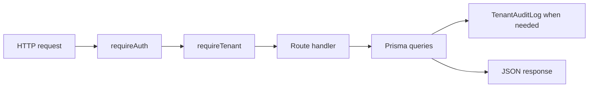

# API

Active contributors: unavailable in this checkout because git history is missing.

The API is an Express server that owns the tenant boundary, validation, Prisma writes, audit logging, and most user-facing workflows. It is the main runtime for the product because the web app depends on it and it also starts the durable SIEM dispatcher.

## Directory layout

```text
apps/api/src/
├── middleware/security.ts
├── remediation/executor.ts
├── routes/
│   ├── admin.ts
│   ├── agents.ts
│   ├── dashboard.ts
│   ├── findings.ts
│   ├── ingestion.ts
│   ├── integrations.ts
│   ├── remediations.ts
│   └── siem.ts
└── server.ts
```

## Key abstractions

| File | Purpose |
| --- | --- |
| `apps/api/src/server.ts` | Server boot, middleware wiring, route mounting, SIEM dispatcher startup |
| `apps/api/src/middleware/security.ts` | Auth parsing, demo fallback, tenant scoping, role checks |
| `apps/api/src/routes/integrations.ts` | Connector catalog, connect/disconnect, per-integration checks |
| `apps/api/src/routes/findings.ts` | List and resolve findings |
| `apps/api/src/routes/remediations.ts` | Run provider remediation actions |
| `apps/api/src/routes/siem.ts` | SIEM destination catalog and CRUD/test APIs |
| `apps/api/src/routes/admin.ts` | Tenant settings, members, audit logs |
| `apps/api/src/routes/agents.ts` | Agent registry, tasks, messages, proposals |

## How it works

Every `/api/v1/*` request goes through `requireAuth` and `requireTenant` from `apps/api/src/middleware/security.ts`. Route handlers then parse the payload with Zod, scope Prisma access by `tenantReq.tenantId`, and serialize dates before returning JSON.



## Integration points

- Reads and writes the Prisma model in `packages/db/prisma/schema.prisma`
- Uses shared contracts from `packages/shared/src/types.ts`, `packages/shared/src/connectors.ts`, `packages/shared/src/siem.ts`, and `packages/shared/src/a2a.ts`
- Encrypts and decrypts secrets through `packages/security/src/crypto.ts`
- Hands background work to `workers/ingestion-worker.ts` and `workers/siem-dispatcher.ts`
- Serves data to `apps/web/lib/api.ts`

## Entry points for modification

If you are adding a new tenant-scoped workflow, start in `apps/api/src/server.ts` to see where the route belongs, then add validation and queries in the matching route file. If the shape is shared with the UI or MCP broker, define it in `packages/shared/src` first.

For endpoint grouping, go to [API surface](../api/index.md). For the web consumer of these routes, go to [Web](web.md).
