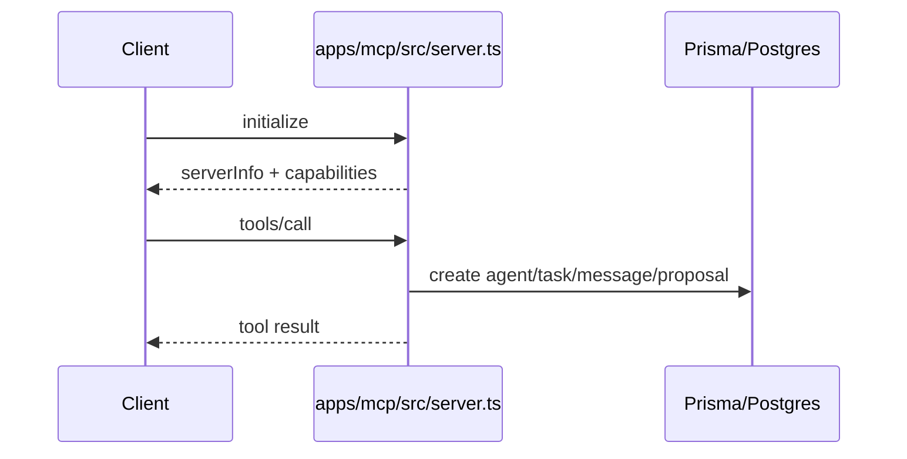

# MCP broker

Active contributors: unavailable in this checkout because git history is missing.

The MCP broker is a stdio JSON-RPC server that exposes agent and SIEM operations to external agent clients. It is smaller than the REST API, but it is important because it turns the database-backed A2A model into a tool-based control surface.

## Directory layout

```text
apps/mcp/
└── src/
    └── server.ts
```

## Key abstractions

| File | Purpose |
| --- | --- |
| `apps/mcp/src/server.ts` | JSON-RPC framing, tool catalog, Prisma-backed tool execution |
| `packages/shared/src/a2a.ts` | Shared schemas for agent registration, tasks, messages, proposals |
| `workers/siem-dispatcher.ts` | SIEM enqueue helper used by the broker |

## How it works

`apps/mcp/src/server.ts` reads framed JSON-RPC messages from stdin, validates them, then responds with `initialize`, `tools/list`, and `tools/call` behavior. The tool handlers write directly to Prisma-backed agent and finding tables.



## Integration points

- Shares the same data model as the REST API through `packages/db/prisma/schema.prisma`
- Reuses the same A2A schemas as `apps/api/src/routes/agents.ts`
- Can enqueue SIEM payloads through `workers/siem-dispatcher.ts`

## Entry points for modification

If you add a new MCP tool, update the `tools` catalog and `callTool` switch in `apps/mcp/src/server.ts`, then decide whether the payload schema belongs in `packages/shared/src/a2a.ts` or `packages/shared/src/siem.ts`. Keep broker behavior aligned with the REST agent model so the two surfaces do not drift.

For the REST version of the same workflows, go to [Agent orchestration](../features/agent-orchestration.md) and [API surface](../api/index.md).
