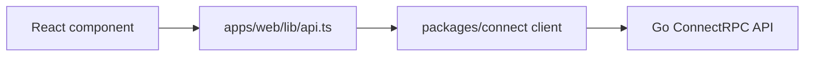

# Web console

`apps/web` is the Next.js operator console. It renders dashboard, findings, apps, connectors, SIEM destinations, security posture, shadow IT, auth, and settings pages.

## Important files

| File | Purpose |
| --- | --- |
| `apps/web/app` | Next.js App Router pages |
| `apps/web/components` | Feature and UI components |
| `apps/web/lib/api.ts` | Typed browser API facade |
| `apps/web/next.config.mjs` | Next.js runtime configuration |
| `packages/connect/src/client.ts` | Generated ConnectRPC client wrapper |

## API access

The console talks to the Go API at `NEXT_PUBLIC_CONNECT_API_BASE_URL`. Typed reads call generated ConnectRPC methods directly. Remaining REST-shaped workflows use `aperioConnectClient.callApi<T>()`, which invokes the Go `CallApi` RPC and keeps existing `/api/v1/*` response shapes stable.



## Development

```bash
npm run dev:web
npm run build:web
npm run typecheck
```
