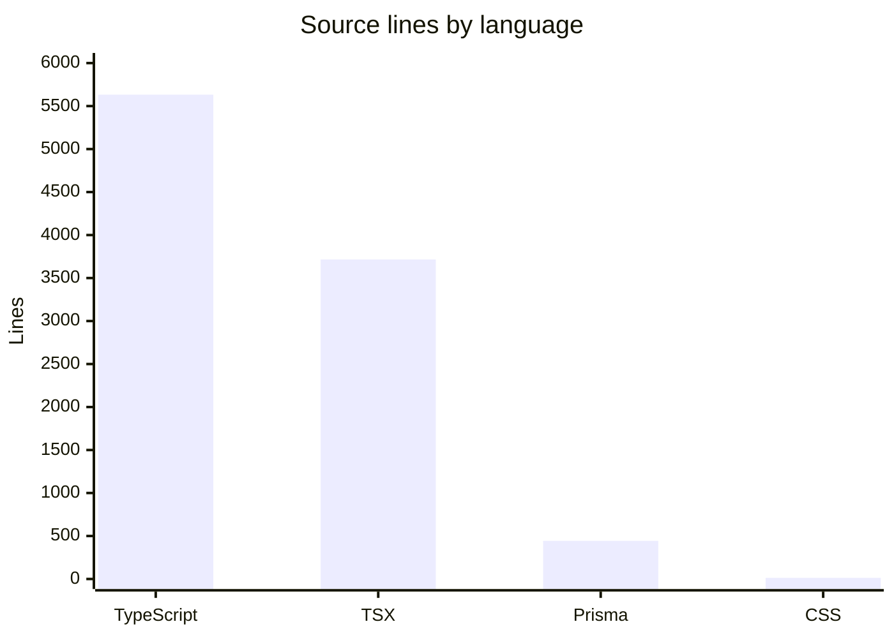

# By the numbers

Data collected on 2026-05-30 from a local working tree of the Aperio repository.

## Size

The repo is small but not tiny. Most of the logic is split between backend TypeScript, frontend TSX, and one Prisma schema.

| Metric | Value |
| --- | ---: |
| Source files (`.ts`, `.tsx`, `.prisma`, `.css`) | 46 |
| Test files | 0 |
| Config and metadata files | 9 |
| Apps under `apps/` | 3 |
| Packages under `packages/` | 3 |

## Activity

Git activity is unavailable in this checkout because the working tree used to generate this snapshot did not include a `.git` directory. That means the usual churn, commit trend, and hotspot data cannot be computed here.

| Metric | Status |
| --- | --- |
| Commits per week/month | Unavailable without `.git` metadata |
| 90-day churn hotspots | Unavailable without `.git` metadata |
| Last branch / commit | Unavailable without `.git` metadata |

## Bot-attributed commits

Bot-attributed commit percentages are also unavailable because commit history is missing from this checkout.

## Complexity

The heaviest files are UI surfaces and catalog definitions. That matches the architecture: one operator console, one API layer, and a few large shared catalogs.

| File | Lines |
| --- | ---: |
| `apps/web/components/connectors/connectors-page.tsx` | 844 |
| `apps/web/components/admin/admin-page.tsx` | 841 |
| `apps/web/components/dashboard/dashboard-page.tsx` | 635 |
| `packages/shared/src/connectors.ts` | 631 |
| `apps/web/components/connectors/siem-section.tsx` | 621 |
| `workers/siem-dispatcher.ts` | 587 |
| `apps/api/src/routes/agents.ts` | 470 |
| `packages/db/prisma/schema.prisma` | 444 |
| `apps/web/lib/api.ts` | 437 |
| `apps/mcp/src/server.ts` | 425 |

Average source-file size by top-level area:

| Area | Avg lines per source file | Source files |
| --- | ---: | ---: |
| `workers/` | 488 | 2 |
| `packages/` | 213 | 8 |
| `apps/` | 203 | 34 |
| `scripts/` | 186 | 1 |

Files with the most `export` statements:

| File | Export count |
| --- | ---: |
| `apps/web/lib/api.ts` | 48 |
| `packages/shared/src/a2a.ts` | 18 |
| `packages/shared/src/types.ts` | 14 |
| `packages/shared/src/connectors.ts` | 14 |
| `packages/shared/src/siem.ts` | 11 |

## Interpretation

A lot of the repo's surface area comes from schema catalogs and UI state management. The biggest maintenance pressure points are the large console pages and the shared connector catalog, not the API entry point itself.

For the structure behind these numbers, go to [Architecture](overview/architecture.md). For concrete files and dependencies, go to [Dependencies](reference/dependencies.md).
