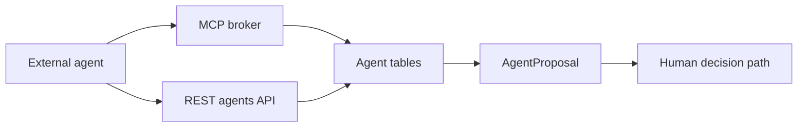

# Agent orchestration

Active contributors: unavailable in this checkout because git history is missing.

This feature adds a tenant-scoped A2A model on top of the SSPM core. Agents can register themselves, create tasks, exchange messages, propose actions tied to findings, and reach the same model through either REST or MCP.

## Directory layout

```text
packages/shared/src/a2a.ts
apps/api/src/routes/agents.ts
apps/mcp/src/server.ts
packages/db/prisma/schema.prisma
```

## Key abstractions

| File | Purpose |
| --- | --- |
| `packages/shared/src/a2a.ts` | Shared schemas and enums for agents, tasks, messages, and proposals |
| `apps/api/src/routes/agents.ts` | REST endpoints for agent CRUD and workflow state |
| `apps/mcp/src/server.ts` | MCP tool exposure for the same model |
| `packages/db/prisma/schema.prisma` | `Agent`, `AgentTask`, `AgentMessage`, `AgentProposal` |

## How it works

The A2A model is stored in Prisma and exposed in two ways. The REST routes in `apps/api/src/routes/agents.ts` are useful for the web or direct HTTP clients. The broker in `apps/mcp/src/server.ts` exposes a smaller tool vocabulary over stdio for agent clients.



## Guardrails in the implementation

- task IDs and finding IDs are checked for tenant ownership before writes
- proposal decisions require `OWNER` or `ADMIN` via `requireRole`
- every approval or rejection writes a `TenantAuditLog` entry

## Integration points

- Can point proposals at `SecurityFinding` rows
- Uses the same tenant and role model as the rest of the API
- Can enqueue SIEM payloads from the MCP side through `workers/siem-dispatcher.ts`

## Entry points for modification

Start in `packages/shared/src/a2a.ts` if the contract changes. Then update both `apps/api/src/routes/agents.ts` and `apps/mcp/src/server.ts` so the REST and MCP surfaces stay aligned.

For the broker itself, go to [MCP broker](../apps/mcp.md). For the persisted entities behind this model, go to [Data models](../reference/data-models.md).
