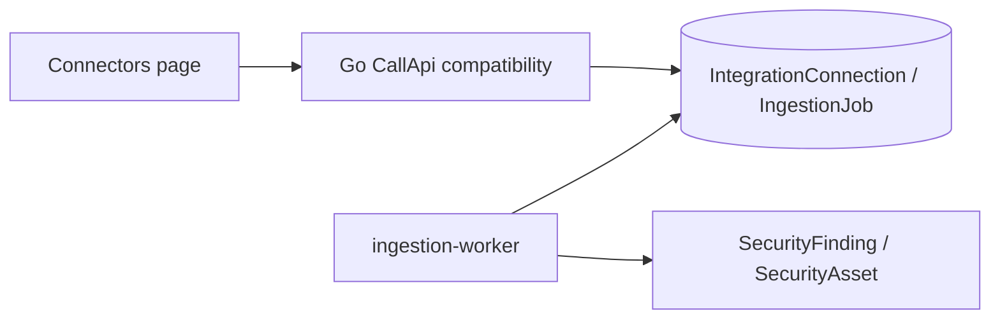

# Connectors and integrations

Connectors let a tenant attach SaaS providers, store encrypted credentials, configure checks, and enqueue ingestion work.

## Main files

| File | Purpose |
| --- | --- |
| `internal/bootstrap/compat_api.go` | Connector catalog, create/update, OAuth, checks, force-sync compatibility handlers |
| `packages/shared/src/connectors.ts` | TypeScript connector catalog and UI-facing metadata |
| `apps/web/components/connectors/connectors-page.tsx` | Connector UI |
| `workers/ingestion-worker.ts` | Provider event processing and finding generation |
| `packages/db/prisma/schema.prisma` | `IntegrationConnection`, `IngestionJob`, `IngestedEvent`, findings/assets |

## Flow

A connector definition drives UI labels, required fields, scopes, and check defaults. Go compatibility handlers persist tenant-scoped connections and queue work; the ingestion worker consumes queued events and writes normalized findings.

## Current migration note

The API runtime is Go, but the richest connector catalog and provider processing still live in TypeScript packages/workers. Keep catalog semantics, encryption envelopes, and queue contracts aligned across the Go API and TypeScript workers.
