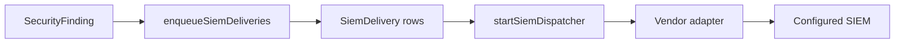

# SIEM delivery

Active contributors: unavailable in this checkout because git history is missing.

This feature lets a tenant register outbound SIEM destinations, test them, and deliver canonical Aperio finding payloads through a durable outbox. It is one of the more complete end-to-end features in the repo because it has shared catalogs, API routes, UI, and background delivery logic.

## Directory layout

```text
packages/shared/src/siem.ts
apps/api/src/routes/siem.ts
apps/web/components/connectors/siem-section.tsx
workers/siem-dispatcher.ts
```

## Key abstractions

| File | Purpose |
| --- | --- |
| `packages/shared/src/siem.ts` | SIEM kinds, field definitions, create payload validation |
| `apps/api/src/routes/siem.ts` | Catalog endpoint and destination CRUD/test routes |
| `apps/web/components/connectors/siem-section.tsx` | Add/test/delete UI for destinations |
| `workers/siem-dispatcher.ts` | Durable outbox, retry logic, delivery adapters |
| `packages/db/prisma/schema.prisma` | `SiemDestination` and `SiemDelivery` tables |

## How it works

The catalog in `packages/shared/src/siem.ts` defines the destination fields. `apps/api/src/routes/siem.ts` stores the destination and encrypts the token if present. When findings are created, `workers/ingestion-worker.ts` enqueues one `SiemDelivery` row per matching destination. `workers/siem-dispatcher.ts` then retries until a row is delivered or reaches the dead-letter threshold.



## Supported targets

The current catalog covers Splunk HEC, Panther, Panopticon, Elastic, Datadog, generic webhooks, and JSON Lines files. The JSON file adapter is useful for local smoke testing because it avoids a real external service.

## Integration points

- Uses encrypted tokens from `packages/security/src/crypto.ts`
- Reads the tenant boundary from `apps/api/src/middleware/security.ts`
- Is surfaced in both `apps/web/components/connectors/connectors-page.tsx` and `apps/web/components/dashboard/dashboard-page.tsx`

## Entry points for modification

Add or change a destination type in `packages/shared/src/siem.ts` first, then implement the adapter in `workers/siem-dispatcher.ts`, then surface any new fields in `apps/web/components/connectors/siem-section.tsx`.

For the route surface, go to [API surface](../api/index.md). For the data model, go to [Data models](../reference/data-models.md).
