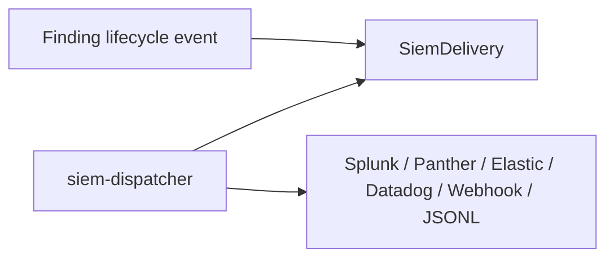

# SIEM delivery

Aperio sends canonical `aperio.finding.v1` envelopes to tenant-configured SIEM destinations through a durable outbox.

## Main files

| File | Purpose |
| --- | --- |
| `internal/bootstrap/compat_api.go` | SIEM catalog, destination CRUD, endpoint validation, test dispatch compatibility |
| `packages/shared/src/siem.ts` | TypeScript SIEM catalog and schemas |
| `internal/siemdispatcher` | Delivery leasing, retries, adapters, dead-letter behavior |
| `internal/ingestionworker` | Enqueues delivery rows when findings are created/updated |
| `apps/web/components/connectors/siem-page.tsx` | SIEM destination UI |

## Flow

The Go dispatcher handles retry/backoff and adapter-specific payload shaping. Destination credentials use the shared AES-256-GCM envelope and tenant/destination AAD so the Go API and Go SIEM dispatcher can exchange encrypted values without exposing plaintext.
