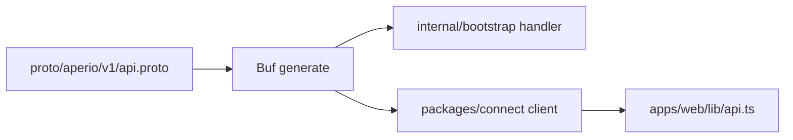

# Patterns and conventions

## API changes

Prefer typed ConnectRPC methods for new workflows:

Use `CallApi` compatibility handlers only when preserving an existing `/api/v1/*` browser contract.

## Tenant scoping

Every API handler, worker lease, and MCP tool must scope data by organization. Never trust IDs from the request body without checking they belong to the authenticated organization.

## Validation

| Area | Pattern |
| --- | --- |
| Go API | Parse/validate inputs, enforce role, scope SQL by organization, serialize stable response shapes |
| Go workers | Validate payloads before processing, mark retries/dead letters explicitly |
| Web | Keep API calls behind `apps/web/lib/api.ts` |
| MCP | Validate tool inputs and map errors to JSON-RPC responses |

## Secrets

Use shared AES-GCM envelopes for credentials. If Go writes a secret that a frontend, test, or tooling TypeScript surface reads, add a contract test or fixture proving compatibility with `internal/runtimeutil` and `packages/security`.
