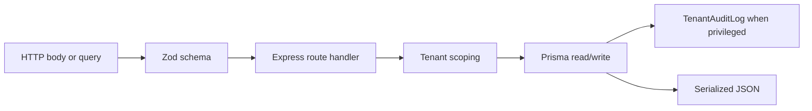

# Patterns and conventions

Aperio uses a consistent pattern across the API, web client, and workers: validate input with Zod, scope everything to a tenant, store long-lived data through Prisma, and write audit logs for privileged changes. Shared catalogs in `packages/shared/src` are the main source of truth.

## Core patterns

### Tenant scoping first

Every `/api/v1/*` route in `apps/api/src/server.ts` passes through `requireAuth` and `requireTenant` from `apps/api/src/middleware/security.ts`. Route handlers then include `organizationId: tenantReq.tenantId` on Prisma queries.

### Shared schema first

If a payload is used by both the API and UI, it usually belongs in `packages/shared/src/types.ts`, `packages/shared/src/connectors.ts`, `packages/shared/src/siem.ts`, or `packages/shared/src/a2a.ts`. Route-local Zod schemas are used when the payload is narrow and local to one handler.

### Encrypt secrets at the boundary

Provider tokens and SIEM credentials are encrypted before they hit the database. The helpers in `packages/security/src/crypto.ts` use AES-256-GCM and tenant-specific AAD strings so ciphertext is bound to its record context.

### Audit privileged actions

Connector changes, SIEM changes, admin changes, remediation actions, and proposal decisions all write `TenantAuditLog` rows through the route transaction.

### Serialize dates explicitly

The API does not return Prisma `Date` objects directly. Route handlers convert them to ISO strings before sending JSON.

## Code conventions by layer

| Layer | Convention | Example files |
| --- | --- | --- |
| API routes | `RequestHandler` + Zod parse + tenant-scoped Prisma | `apps/api/src/routes/integrations.ts`, `apps/api/src/routes/siem.ts` |
| Workers | plain functions/classes with `jsonSafe` helpers and direct Prisma writes | `workers/ingestion-worker.ts`, `workers/siem-dispatcher.ts` |
| Web UI | client components with `useEffect`, `useState`, typed API helpers | `apps/web/components/dashboard/dashboard-page.tsx`, `apps/web/components/connectors/siem-section.tsx` |
| Shared packages | exported Zod schemas and catalogs instead of classes | `packages/shared/src/a2a.ts`, `packages/shared/src/connectors.ts` |

## Diagram-worthy flow that repeats throughout the repo

## Gaps to keep in mind

- The ingestion queue in `workers/ingestion-worker.ts` is in memory.
- Provider detection coverage is narrower than the connector catalog.
- The web UI has some large, stateful files instead of smaller feature slices.
- There is no formal test harness to backstop refactors.

For command-level tooling, go to [Tooling](tooling.md). For API surface details, go to [API surface](../api/index.md).
