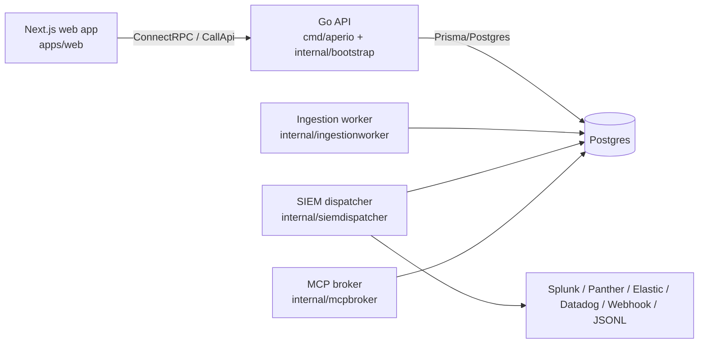
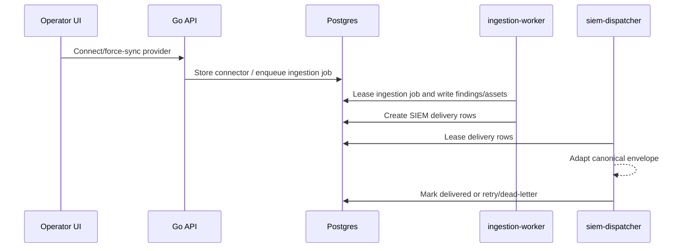

# Architecture

Aperio has four Go-owned backend runtime surfaces: the Go/ConnectRPC API, ingestion worker, SIEM dispatcher, and stdio MCP broker, plus the Next.js console. Shared schemas live in `packages/shared/src`, persistent state lives in `packages/db/prisma/schema.prisma`, and secret handling lives in `packages/security/src/crypto.ts`.

## API boundary

The Go API exposes typed ConnectRPC methods from `proto/aperio/v1/api.proto`. The web console also sends REST-shaped `/api/v1/*` requests through the `CallApi` RPC in `apps/web/lib/api.ts`; those routes are compatibility handlers in `internal/bootstrap/compat_api.go` until each workflow graduates to typed RPCs.

## Ingestion and SIEM flow

## Security model

- Sessions are stored in `user_sessions` and carried by the `aperio_session` HttpOnly cookie.
- The Go API validates cookie token hashes directly against Postgres.
- `APERIO_WEB_ORIGIN` controls credentialed browser CORS.
- Tenant scoping is enforced in Go API queries and worker leases by `organization_id`.
- Credentials are encrypted with AES-256-GCM helpers in `packages/security`.
