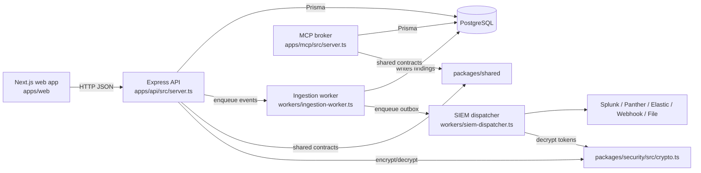
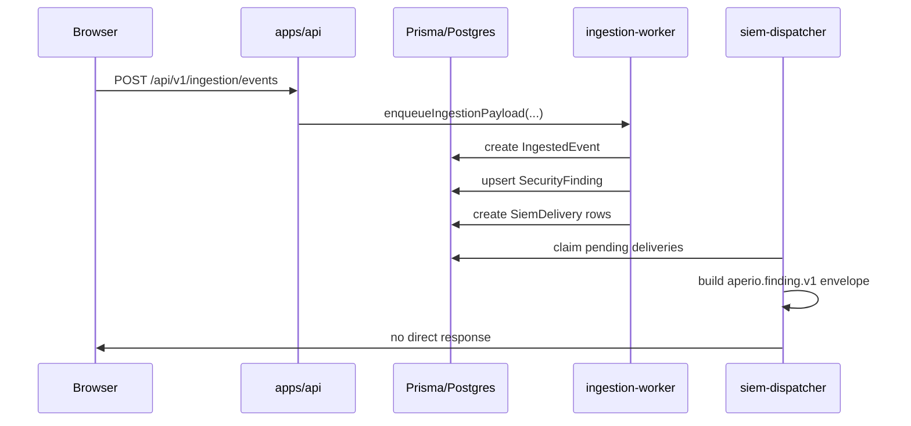
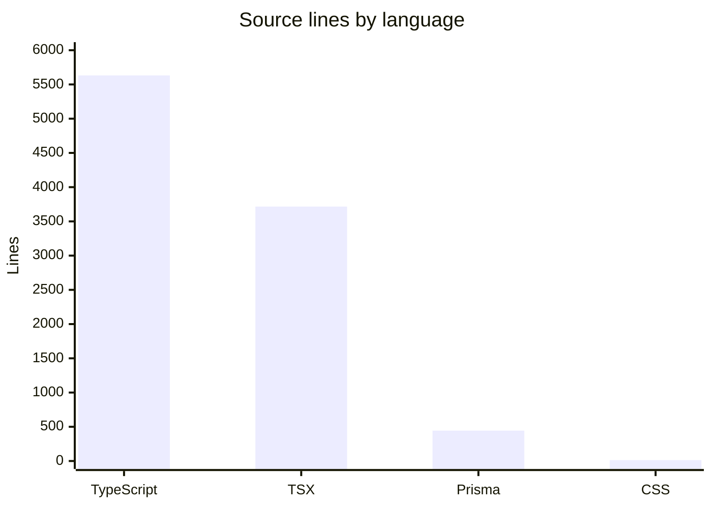

# Architecture

Aperio has three runnable surfaces: the Express API in `apps/api/src/server.ts`, the Next.js console in `apps/web/app/layout.tsx`, and the MCP broker in `apps/mcp/src/server.ts`. Shared schemas live in `packages/shared/src/*.ts`, persistent state lives in `packages/db/prisma/schema.prisma`, and secret handling lives in `packages/security/src/crypto.ts`.

## System layout

## Request and processing flow

## Major components

| Component | Key files | Role |
| --- | --- | --- |
| Web console | `apps/web/app/page.tsx`, `apps/web/components/dashboard/dashboard-page.tsx`, `apps/web/components/connectors/connectors-page.tsx`, `apps/web/components/admin/admin-page.tsx` | Operator UI for findings, connectors, SIEM, apps, and admin settings |
| REST API | `apps/api/src/server.ts`, `apps/api/src/routes/*.ts` | Tenant-scoped CRUD and action layer |
| Background processing | `workers/ingestion-worker.ts`, `workers/siem-dispatcher.ts` | Event evaluation, finding creation, SIEM delivery |
| MCP broker | `apps/mcp/src/server.ts` | JSON-RPC tool surface for A2A workflows |
| Shared contracts | `packages/shared/src/types.ts`, `packages/shared/src/connectors.ts`, `packages/shared/src/siem.ts`, `packages/shared/src/a2a.ts` | Zod schemas, catalogs, and shared enums |
| Persistence | `packages/db/prisma/schema.prisma`, `packages/db/src/client.ts` | Tenant data model and Prisma client |
| Secret management | `packages/security/src/crypto.ts` | AES-256-GCM encryption with additional authenticated data |

## Language mix in source files

The bulk of the repo is TypeScript and TSX. Prisma is used for the schema, and CSS is minimal.

## Design choices that matter

- Every API route under `/api/v1` passes through `requireAuth` and `requireTenant` in `apps/api/src/middleware/security.ts`.
- Connectors, SIEM destinations, and A2A workflows are all catalog or schema driven, which keeps the UI and API in sync through shared files in `packages/shared/src`.
- Ingestion and SIEM delivery both use database-backed queues before fanout, which keeps accepted events and outbound deliveries durable across API restarts.
- Remediation is intentionally narrower than detection. Only a few handlers in `apps/api/src/remediation/executor.ts` do real work today; the rest are explicit stubs.

For setup details, go to [Getting started](getting-started.md). For the runtime surfaces, go to [Apps](../apps/index.md).
