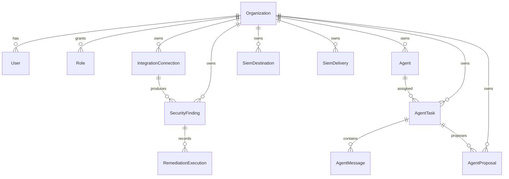

# Data models

The source of truth for persistent state is `packages/db/prisma/schema.prisma`. The schema falls into four groups: tenant identity, integrations and findings, SIEM delivery, and agent orchestration.

## Identity and tenancy

| Model | Purpose |
| --- | --- |
| `Organization` | Tenant record and default governance settings |
| `User` | User identity scoped to an organization |
| `Role` | Role assignment for a user in an organization |
| `TenantAuditLog` | Audit trail for privileged actions |

## Integrations and findings

| Model | Purpose |
| --- | --- |
| `IntegrationConnection` | One connector instance for a tenant |
| `IngestedEvent` | Raw inbound SaaS event payload |
| `SecurityFinding` | Normalized detection record |
| `RemediationExecution` | History of attempted write actions |

Important enums in this area include `SaaSProvider`, `IntegrationMode`, `FindingSeverity`, `FindingStatus`, and `RemediationStatus`.

## SIEM delivery

| Model | Purpose |
| --- | --- |
| `SiemDestination` | One outbound sink configuration |
| `SiemDelivery` | Durable outbox row for a canonical payload |

Important enums here include `SiemDestinationKind`, `SiemDeliveryStatus`, and `SiemPayloadType`.

## Agent orchestration

| Model | Purpose |
| --- | --- |
| `Agent` | Registered actor |
| `AgentTask` | Unit of work for an agent |
| `AgentMessage` | Message between agents or tasks |
| `AgentProposal` | Proposed action that may need approval |

Important enums here include `AgentKind`, `AgentStatus`, `AgentTaskStatus`, `AgentMessageKind`, and `AgentProposalStatus`.

## Relationship sketch

## Entry points for modification

Schema changes start in `packages/db/prisma/schema.prisma`, then flow outward into route handlers, workers, and UI types. Because there are no migration files in this checkout, local development typically uses `prisma db push` rather than checked-in SQL migrations.

For the package that owns this schema, go to [DB](../packages/db.md). For the API and UI that use it, go to [API](../apps/api.md) and [Web](../apps/web.md).
